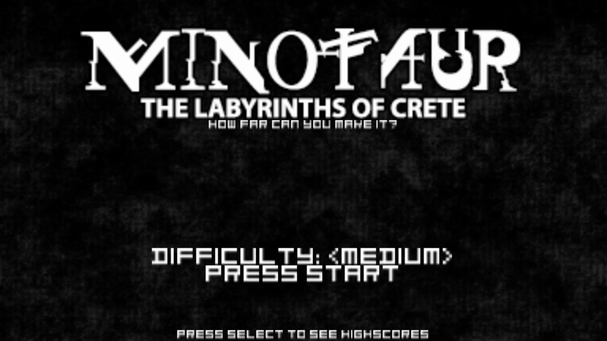
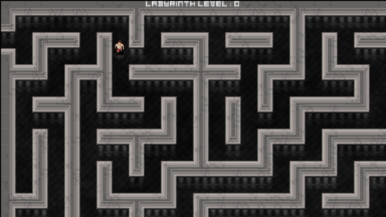
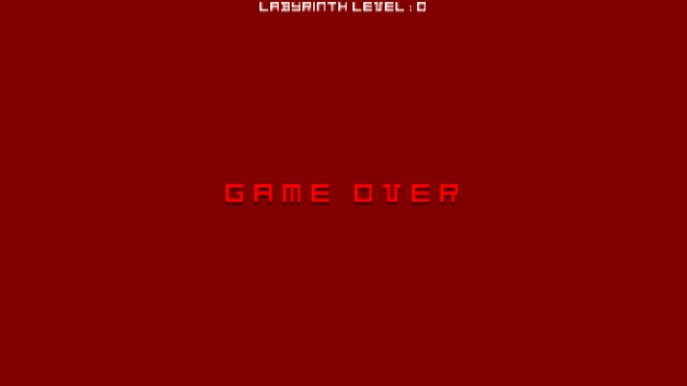

# Minotaur: The Labyrinth of Crete

<p align="center"></p>

Enter the labyrinth and test your courage and wit. Will you survive to the exit, or will you perish at the mighty axe of the MINOTAUR?

The initial maze size and Minotaur speed is determined by the Difficulty Level you select. Each time you successfully exit the maze the Difficulty multiplier increases by .1 as does the map size.
For Example if you choose Minotaur Difficulty which is Level 5 the maze will be 5times as large, and well as increase the Minotaur's Speed. 
Starting at the highest difficulty may cause some heavier load times, but trust me it will load. There is an encrypted-load/save system for Top-5 highscores as well as an initial entry system to keep track of who is the best!

## Difficulty Levels

- Easy
- Medium
- Hard
- Spartan
- Minotaur

## Changelog

### v1.0

- Initial Release.

## Setup Instructions (For End Users)

- Download and install to the main directory (usually `ux0:`) and choose install, once installed you can delete the Minotaur.vpk file to prevent clutter:

```
ux0:Minotaur.vpk
```
No additional Data Files are required.


### The Forgotten Labyrinth (Initial Entry Song Lyrics)

```
[Verse]
Through shadowed halls the echoes sing
A whisper soft where no bells ring
The torchlight wavers on the stone
Each step feels heavy
Yet alone

[Chorus]
Lost in the maze where the walls breathe fear
The forgotten labyrinth draws you near
Twist and turn
The way unclear
Will you escape or disappear

[Verse 2]
A rusted blade lies by the door
Its tale untold
Its battles no more
The walls are etched with cries of old
A treasure hidden
Or a curse retold

[Prechorus]
The air grows thin
The floor might fall
Do you dare answer the darkness' call

[Chorus]
Lost in the maze where the walls breathe fear
The forgotten labyrinth draws you near
Twist and turn
The way unclear
Will you escape or disappear

[Bridge]
The harpstrings hum from unseen hands
The lute laments from spectral bands
A drumbeat echoes—boom
Then fade
The dungeon's song
A trap well-laid
```

<p align="center"></p>
<p align="center"></p>
<p align="center"></p>
